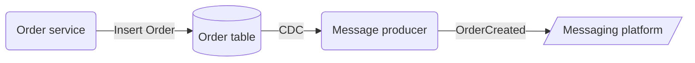
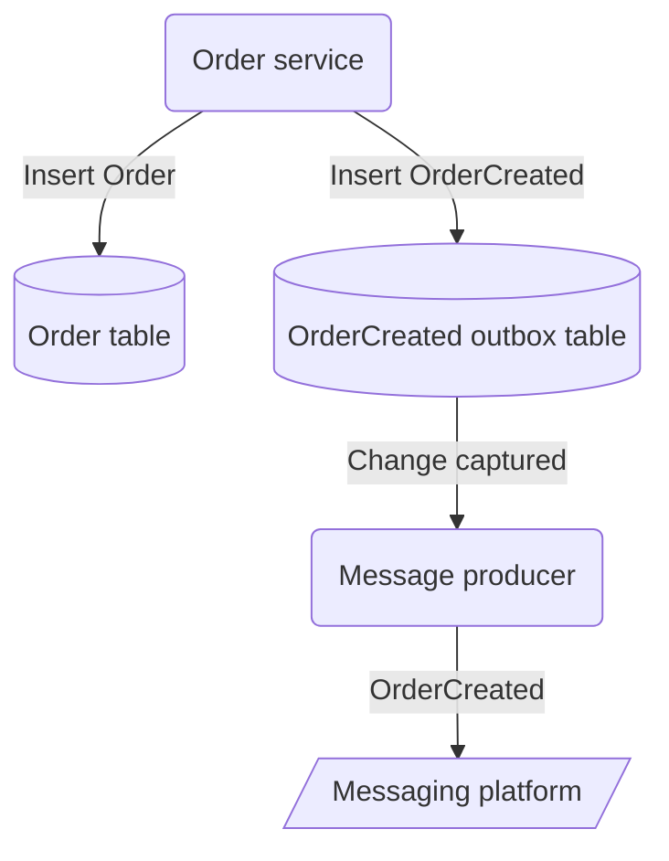
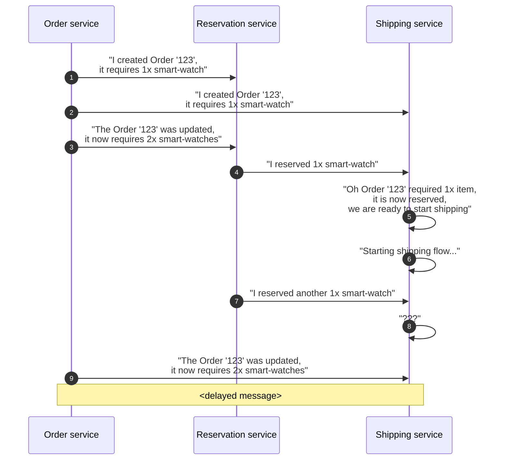
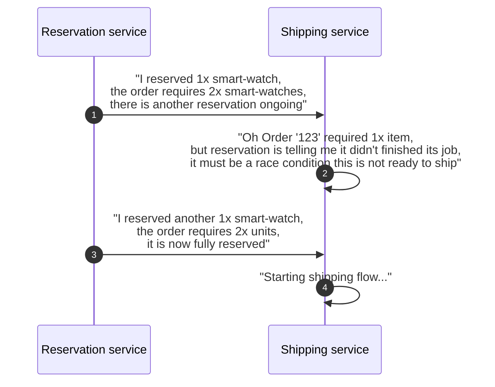

The part 1 of this series [Consistency with microservices][article-part-1] uncovered pitfalls with simple message delivering patterns and its associated guarantees.

This part will cover more complex approaches that provide stronger guarantees.

# Dual-writes

The problem of dual-writes happens anytime a workflow needs to write to multiple storages and need them to happen atomically, so either they all happen or none of it happen.

The chances of inconsistencies increases as the workflow is extended to write to multiple storages: Database, messaging platform, update cache, update elasticsearch, etc...

Besides this, it ties the availability of multiple infrastructure components reducing the overall availability of the workflow:

From [AWS SLAs][aws-slas]:
- AWS messaging availability is 99.5% (1 day downtime an year)
- AWS databases availability is 99.5% (1 day downtime an year)

Following the formula for the compound probability of independent events occurring together:
$ P (A \text{ and } B) = P(A) * P(B) $

$ 0.995 * 0.995 = 0.990 $

The overall workflow availability based on dual-writes is reduced to 99.0%, and downtime is amplified to 3 days an year.

# Change Data Capture (CDC)

CDC is a built-in feature in databases such as [Cassandra][cassandra-cdc] and [Cosmos DB][cosmos-cdc] to implement the Observer pattern on data.

It allows to implement a service that reacts to a stream of data changes and do some operation, similar to what traditional Triggers provided but completely extracting logic from the database layer

The same could be achieved by querying the database regularly, but there would be limitations on latency, and on capturing deletes and updates that can only be provided by reading the actual log of transactions.

CDC allows for a low-latency pull-based access to the database log of transactions, guaranteed to capture all data changes, with at-least-once guarantees

> How could CDC alone help to avoid rollbacks on the [at-least-once scenario][article-part-1-rollback]?

One could make a separated service that listen to and reacts when an new Order is inserted on the Order table, and uses the new record to produces the OrderCreated message asynchronously.
This still provides an atomicity guarantee that the message is always produced (eventually) and always after the database writting.

This is an idea I had and discussed with my team when refactoring a project, and while it is on the right track I realized this would be a bad idea.

The problem on this approach is that it takes away from the workflow the power of defining the message content, leading to the problems such as:
* Increased complexity because the message definition logic is now hidden on this intermediate service that produces the OrderCreated message
* The job of the OrderCreated message producer is not easy, it is based on lots of inferences, mainly because it doesn't have enough context to do its job except from what it reads from the database Order data model
* The Order data model may become a mix of data and messaging model to facilitate the job of the OrderCreator producer, it tries to satisfies both needs but ultimately doesn't fit any
* Strong coupling between the message model and the Order data model

# The outbox pattern

A better approach with CDC is by implementing an Outbox, to define clear boundaries between the data model and the message model.

The Outbox Pattern is a technique that uses your database as a queue, and uses an [Transaction Log Tailing][transaction-log-tailling] mechanism based on CDC to replicate data from the database queue to a messaging platform.

The message model is defined on the OrderCreatedOutbox table on the database completely decoupled from the Order table model.

It also gives the control back to the workflow on populating the message and its content.

With an outbox a workflow can either do both data and message writting atomically in a database transaction, or if not using a transaction be able to query the database to check if the message was populated and retry if needed.

The outbox pattern guarantees the message is eventually produced to the messaging platform.
Moreover, it increases the workflow availability by depending only on the database availability.

# Event sourcing

> "Eventsourcing uses storage as a way of communication, it solves storage and messaging for you"  Vaugh Vernon, on Domain-Driven Design Distilled book

On an event sourced database data is stored as it were messages, there are no tables, instead there are streams of events that mimics a queue of messages.
In fact the difference from events and messages, are that events are part of the data that lives inside layer (but also immutable), whether messages are part of the data that lives outside layer.

Unfortunately *Event* is such an overheaded term that is used on both situations, messages are even called *integration events* in DDD world,
[Martin Fowler][martin-fowler-twitter] has a nice presentation on the many meanings of the *Event* term:

An event is both a data to be stored on the database and data that carries enough context to communicate what has happened to an aggregate.

Because it is so close to a message, it is simpler to outsource the message definition logic to a CDC-based message producer as discussed in [Change Data Capture (CDC)](#change-data-capture-cdc).
With an event providing context to the message producer, what is outsourced to this service is mostly the decision of what events should be published to the outside world and the mechanics of using the messaging platform.

The same data model concerns pointed in [Change Data Capture (CDC)](#change-data-capture-cdc) also applies here though, it is still important to not fall into the trap of leaking the message model to the event model,
and it should leverage stream-table join operations to enrich the final message when needed.

# Event-carried state

There are other sources of inconsistency that are completely isolated on the data that lives outside layer.

It happens when services are weakly integrated to each other and their contracts don't communicate clearly.

When messages are designed as deltas, they individually don't provide enough information to communicate the whole picture of the on-going operation.

Services consuming this contract have to join information from multiple messages and make assumptions to reach enough information to make a decision.

Correlating messages gets tricky when messages either don't arrive or are processed out of order.

This approach leaves a lot of room for bad assumptions under race conditions.

If only the Reservation service could provide a full picture of the reservation status for that order.

Contracts should strive for intuitive consistency, and messages design with event-carried state provide not just information about the event itself but also a summary of the current state of an aggregate, so consumers don't have to infer the state of the aggregate.

Finally, adding this summary to messages prevents downstream services to have to call back the service to get more information, leading also to higher availability.

[martin-fowler-integration-database]: https://martinfowler.com/bliki/IntegrationDatabase.html
[pat-helland-paper]: https://queue.acm.org/detail.cfm?id=3415014
[saga]: https://microservices.io/patterns/data/saga.html
[aws-slas]: https://aws.amazon.com/legal/service-level-agreements/
[cosmos-cdc]: https://docs.microsoft.com/en-us/azure/cosmos-db/sql/change-feed-processor
[cassandra-cdc]: https://cassandra.apache.org/doc/latest/cassandra/operating/cdc.html
[transaction-log-tailling]: https://microservices.io/patterns/data/transaction-log-tailing.html
[martin-fowler-twitter]: https://twitter.com/martinfowler
[article-part-1]: consistency-with-microservices.html
[article-part-1-rollback]: consistency-with-microservices.html#at-least-once-delivery