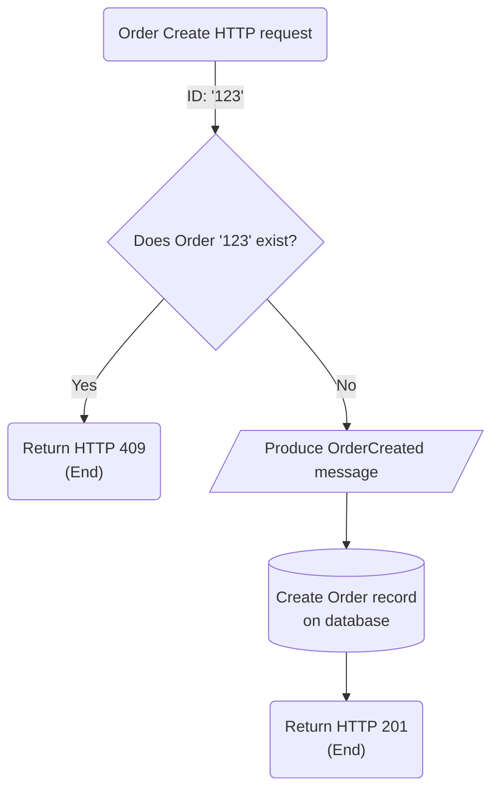
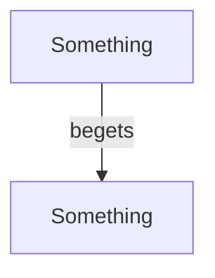

In a microservices or shared-nothing architecture, databases are not shared between bounded-contexts.
In fact the least they share the more decoupled, autonomous and available they are.

[Integration through the database][martin-fowler-integration-database] is replaced by integration through an unreliable communication medium, tipically an API or messaging platform.

This data isolation creates 2 layers of data in a system, as [Pat Helland's paper][pat-helland-paper] describes:
- **Data that lives inside**: it's your classic data stored in a SQL database, it's private and mutable
- **Data that lives outside**: refers to data that flows between services, e.g. messages and API requests. It's public, immutable, and uniquely identified

This leads to a strong boundary between services, that translates into high autonomy.

A service can do whatever it wants with the data that lives inside and rest assured it will never impact the outside world, as far as it can respect its API and message contracts.
The team that owns a service can tackle tech debt at their own pace, migrate to different technologies, or completely rewrite the service, with minimal coordination and friction with the rest of the organization.

High autonomy lends itself to high availability, particularly if services communicate assynchronously by messaging helping services to untie their availability from each other, so when an service's API goes down it doesn't cause a ripple effect blocking all dependant services.

As the law of physics of the CAP theorem tell us, when we increase availability we lose consistency.
Now we have 2 data layers, one that lives inside, another outside, which have different models, are updated at different times, and are not always consistent with each other.

The descentralization of distributed systems brings many advantages, but it adds considerable complexity for systems.
Particularly making it fault-tolerant is a lot of work, as a developer there will be days full of suspicion and paranoia thinking deeply on all the things that can go wrong.

Let's explore the sources of inconsistencies with this setting:

# Partial executions

A workflow inside a microservice tipically write stuffs to a database and produce a message or API request to another service

What happens when some infrastructure component goes down during the workflow execution and it can't complete?

The beginning of the workflow may execute, but some part at the end may not, the side effects of this workflow execution are then partially applied, and the order of its steps matter.

# At-most-once delivery

Consider a feature for Report Generation that is done asynchronously and may take minutes to complete, the user is updated by email about each stage of the process.

When creating the Report generation request, the system sends an email to the customer to log that a Report Request was created and will be processed soon.

The steps of this workflow are:
1. The frontend calls the Report API passing on an ReportRequestId and criterias for the report
2. The API validates if that ReportRequestId is already created
3. If yes, it returns an HTTP 409 code to signal the Id provided has already been taken by an existing resource
4. If not, it creates the ReportRequest record on the database
5. At the end it sends a request to an Email platform to update the customer that the ReportRequest was created
6. Returns an HTTP 201 code

@startmermaid
flowchart TB
    A(Generate Report HTTP request) --> |ID: '123'| B{Does ReportRequest '123' exist?}
    B --> |Yes| C("Return HTTP 409 \n #40;End#41;")
    B --> |No| D[(Create ReportRequest record \n on database)]
    D --> E>Send HTTP request to Email Platform]
    E --> F("Return HTTP 201 \n #40;End#41;")
@endmermaid

What if the Email platform is down at step 5?
The workflow created the ReportRequest record on the database, and now any attempt to retry the request will execute up to step 3

Tipically there is a database writing step that marks the workflow as completed (step 4), together with an idempotency guard (step 2) to supress duplicated side effects.

When retrying on a request that is marked as completed, your service has no way to distinguish between the scenario where the client is sending a duplicated request, or the scenario where the client is retrying a partially executed request that failed after the workflow was marked as completed.

In summary, on best case scenario the step 5 successfully sends the Email request once, otherwise the Email request is lost forever.

This is an at-most-once guarantee.
This model is applied on non-critical communication that presents low business impact if it is never sent.

This is not applicable for critical communication that triggers a chain of processings or [Saga][saga] on other services.
If the message is lost forever, downstream services will never be able to pick it up and continue the chain of processings.

# At-least-once delivery

Imagine a Order creation service that produces an OrderCreated message to trigger workflows downstream for: Handle payment, Reserve inventory, Produce reports, etc...

The steps of this workflow are:
1. The frontend calls the Order API passing on the Order payload
2. The API validates if that OrderId is already created
3. If yes, it returns an HTTP 409 code to signal the Id provided has already been taken by an existing resource
4. If not, it produces an OrderCreated message to a topic
5. At the end it creates the Order record on the database
6. Returns an HTTP 201 code

If the message is produced before the database writing, in a partial execution scenario the workflow will be retried until the database writing succeeds and the message is guaranteed to be sent.

This is an at-least-once guarantee, it is a stronger guarantee that ensures the message is always delivered, up to N times as the workflow is retried N times until it fully executes.

This provides a strong enough guarantee for most situations while simple enough.
For instance I happened to work on the redesign of a system fully based on [Change Data Capture][article-part-2-cdc] that was migrating to this model for its simplicity and for being a good fit for most of our workflows.

However there are still some challenges with this model, as described below.

**Idempotency**

One of the challenges is that it may produce the same message N times, and is not responsible for supressing duplicated side effects anymore.

Services consuming the OrderCreated message may assume multiple Orders were created.

This model requires that messages are designed to be uniquely identified, e.g. by an OrderId field, and requires an effort accross the system to ensure this identifier is used for deduplication and idempotency

This is easy though, because services should be idempotent anyway to be resilient to situations that may cause messages to be consumed >1 times even though it was produced only once, such as when processing in batches or consumer offset skews.

**Race conditions**

> What happens if is fails at step 5, and it takes some time and many retries to succeed?

During this time window downstream services may have already processed the OrderCreated message faster than the database writing suceeds, maybe one of these services attempted to make HTTP requests back to your service to ask more information about the Order and it failed because the Order didn't exist yet.

Race conditions are temporary inconsistencies and are in the nature of distributed systems.

Services must be designed with resilience in mind, assuming anything may be unavailable and fail anytime.

As far as things are eventually consistent it is fine to mitigate these with resilience guards, the same way you would validate if inputs are null before executing a function.

**Rollbacks**

The main challenge are rollbacks.

> What if only at step 5 you discover the Order can't be created?

Possible scenarios:
* The client gives up about the Order and stops retrying
* Some of the business invariants is checked at the database level
* This is a non-deterministic flow such as a reservation. The database writing is competing for resoures and the writting fails to avoid overbooking

But now downstream services are already processing the message, handling payment, moving inventory, and it rippled out a permanent inconsistency across the system.

Data that lives outside is immutable, a message can't be unsend and rollback across the system takes a heavy toll.

In order to rollback it needs to span a whole Order Cancellation saga, to notify other services and allow them to take compensatory actions, e.g. refund payment.

Saga implementations are complex, it requires strong coordination and testing between multiple teams, it is usually designed by a high-level architect that understands most of or the whole system.

Cancellation sagas may exist as part of the business rules, but in this example it exists purely for technical reasons requiring quite extra work.

To avoid rollbacks we need a stronger guarantee when delivering messages, we need the best of both worlds, we need somehow to ensure the message is always produced while also as the lastest step of the flow to avoid bad assumptions.

# Consistency with microservices (Part 2)

Follow the part 2 of this series on [Consistency with microservices (Part 2)][article-part-2]

[martin-fowler-integration-database]: https://martinfowler.com/bliki/IntegrationDatabase.html
[pat-helland-paper]: https://queue.acm.org/detail.cfm?id=3415014
[saga]: https://microservices.io/patterns/data/saga.html
[aws-slas]: https://aws.amazon.com/legal/service-level-agreements/
[cosmos-cdc]: https://docs.microsoft.com/en-us/azure/cosmos-db/sql/change-feed-processor
[cassandra-cdc]: https://cassandra.apache.org/doc/latest/cassandra/operating/cdc.html
[transaction-log-tailling]: https://microservices.io/patterns/data/transaction-log-tailing.html
[martin-fowler-twitter]: https://twitter.com/martinfowler
[article-part-2]: 2022-06-07-consistency-with-microservices-part-2.html
[article-part-2-cdc]: 2022-06-07-consistency-with-microservices-part-2.html#change-data-capture-cdc