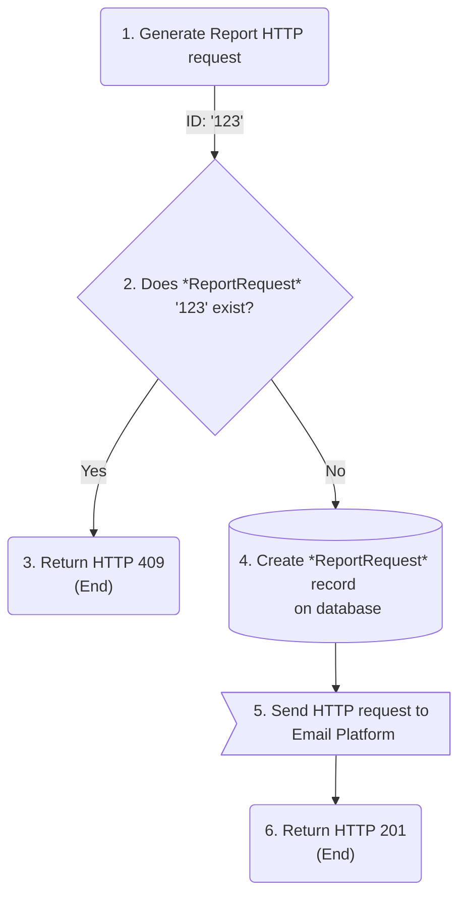
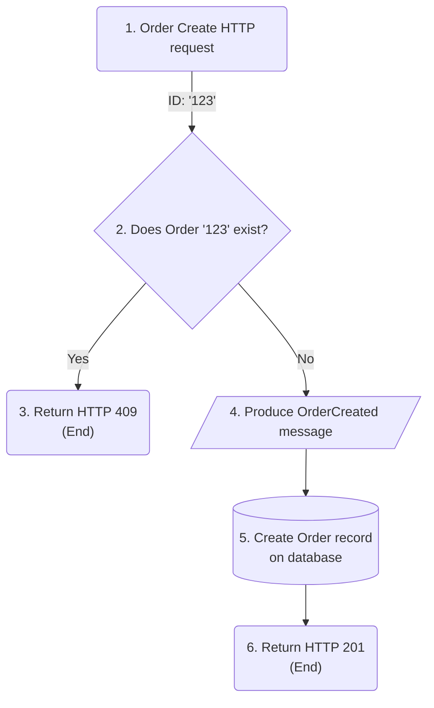

A workflow inside a microservice typically writes stuff to a database and produces a message or API request to another service.

> What if some infrastructure component goes down during the workflow execution and it can't complete?

The beginning of the workflow may execute, but some parts at the end may not, the side effects of this workflow are then partially applied.

This situation leaves data in an incomplete state, that needs to be fixed by either retrying until complete or rollbacking entirely.

This is a partial execution scenario, and the order in which a workflow executed its steps is directly related to its consistency guarantees.

It all boils down to what was executed first between the two: The database writing or the message/API request delivery?

# At-most-once delivery

Consider a feature for Report Generation that is done asynchronously and may take minutes to complete, the user is updated by email about each stage of the process.

When creating the Report generation request, the system sends an email to the customer to log that a Report Request was created and will be processed soon.

The steps of this workflow are:
1. The client calls the Report API passing on a *ReportRequestId* and criteria for the report
2. The API validates if that *ReportRequestId* is already created
3. If yes, it returns an *HTTP 409* code to signal the Id provided has already been taken by an existing resource
4. If not, it creates the *ReportRequest* record in the database
5. In the end, it sends a request to an Email platform to update the customer that the *ReportRequest* was created
6. Returns an *HTTP 201* code

{:style="text-align:center;"}

> What if the Email platform is down at step 5?

The workflow created the *ReportRequest* record on the database, and now any attempt to retry the request will execute up to step 3.

This is because typically there is a database writing step that marks the workflow as completed (step 4), together with an idempotency guard (step 2) to suppress duplicated side effects.

After a request is marked as completed, the service has no way to distinguish between the scenario where a client is sending a duplicated request or the scenario where a client is retrying a partially executed request.

In summary, in the best-case scenario, step 5 successfully sends the Email request once, otherwise, the Email request is lost forever.

This is an at-most-once guarantee, i.e. no guaranteed delivery.
Its implementation executes the final database writing before the message or request is sent.
This model is applied to non-critical communication that presents low business impact if it is never sent.

At-most-once delivery isn't suitable for critical communication though, one that triggers a chain of required processing on other services.
If the message is lost forever, other services will never be able to pick it up to continue processing.

# At-least-once delivery

Let's imagine another scenario with an Order creation service that produces an *OrderCreated* message to trigger workflows downstream for handling payments, reserving inventory, producing reports, etc.

The steps of this workflow are:
1. The client calls the Order API passing on the Order payload
2. The API validates if that OrderId is already created
3. If yes, it returns an *HTTP 409* code to signal the Id provided has already been taken by an existing resource
4. If not, it produces an OrderCreated message to a topic
5. In the end, it creates the Order record on the database
6. Returns an *HTTP 201* code

{:style="text-align:center;"}

> What if the *OrderCreated* message producing fails at step 4?

In a partial execution scenario, the workflow will be retried until the final database writing succeeds, and the request is marked as completed.
As the message is produced before the database writing, the message is guaranteed to be sent.

This is an at-least-once guarantee, it is a stronger guarantee than at-most-once and ensures the message is always delivered.

This provides a strong enough guarantee for most workflows while simple enough.
I happened to work on the redesign of a system fully based on [Change Data Capture][article-part-2-cdc] that was migrating to this model for its simplicity and for providing enough consistency for most of our workflows.

However, there are still challenges with this model, as described below.

##### Idempotency

This model allows a service to produce the same message *N* times, as it retries *N* times, hence it doesn't take care of suppressing duplicated side effects anymore.

Services consuming the *OrderCreated* message may assume multiple Orders were created.

This model requires that messages are designed to be uniquely identified, e.g. by an *OrderId* field, and requires an effort across the system to ensure this identifier is used for deduplication and idempotency

This is easy though because services should be idempotent anyway to be resilient to situations that may cause messages to be consumed more than once even though it was produced only once, such as when processing in batches or consumer offset skews.

##### Race conditions

> What if it fails at step 5 and takes many retries to succeed?

During this time window, downstream services may have already processed the *OrderCreated* message faster than the database writing finally succeeds.
Maybe one of these services attempted to make HTTP requests back to your service to ask for more information about the Order and it failed because the Order didn't even exist yet.

Race conditions are temporary inconsistencies and are at the heart of developing distributed systems, and services must be designed with resilience in mind, assuming anything may be unavailable and fail at anytime.

As far as things are eventually consistent it is possible to mitigate these situations with resilience guards, to ensure all required conditions are in place and avoiding assumptions before executing anything, the same way you would validate if inputs are *null* before executing your function.

##### Rollbacks

> What if only at step 5 do you discover the Order can't be created?

Possible scenarios:
* Some of the business invariants are checked at the database level
* This is a non-deterministic flow such as a reservation, and the database writing fails to avoid overbooking
* The client just gives up on the Order and stops retrying

Now downstream services are already processing the message, handling payment, and moving inventory. It rippled out a permanent inconsistency across the system.

As [Pat Helland's paper][pat-helland-paper] describes, data that lives outside is immutable, a message can't be un-sent and rollback across many services takes a heavy toll.

To roll back, it needs to span a whole Order Cancellation [Saga][saga], to notify other services and allow them to take compensatory actions, e.g. refund payment.

Sagas are costly to implement tough, it requires strong coordination and testing between multiple teams, and it is usually designed by a high-level architect that understands most of the system.

# Dual-writes

The strategies above follow the *dual-writes* pattern, which is anytime a workflow has to write to two or more storages while not leveraging any transaction isolation.

To ensure messages are delivered while mitigating the costs of rollbacks, a service needs atomicity guarantees that are not provided by this pattern.
Follow the [Solving Dual-writes: Change Data Capture, The Outbox Pattern, and Event Sourcing][dual-writes-article] post to learn more about strategies that provides atomicity.

[article-part-2-cdc]: ../../../2022/06/17/solving-dual-writes-with-cdc-and-the-outbox-pattern.html#change-data-capture-cdc
[pat-helland-paper]: https://queue.acm.org/detail.cfm?id=3415014
[saga]: https://microservices.io/patterns/data/saga.html
[dual-writes-article]: ../../../2022/06/17/solving-dual-writes-with-cdc-and-the-outbox-pattern.html