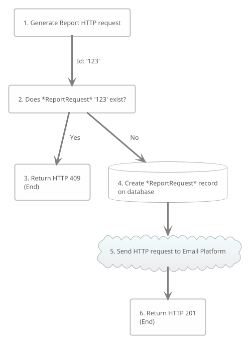

A workflow inside a microservice typically writes stuff to a database and produces a message or API request to another service.

> What if some infrastructure component goes down during the workflow execution and it can't complete?

The beginning of the workflow may execute, but some parts at the end may not, the side effects of this workflow are then partially applied.

This situation leaves data in an incomplete state, that needs to be fixed by either retrying until complete or rollbacking entirely.

This is a partial execution scenario, and the order in which a workflow executed its steps is directly related to its consistency guarantees.

It all boils down to what was executed first between the two: The database writing or the message/API request delivery?

# At-most-once delivery

Consider a feature for Report Generation that is done asynchronously and may take minutes to complete, the user is updated by email about each stage of the process.

When creating the Report generation request, the system sends an email to the customer to log that a Report Request was created and will be processed soon.

The steps of this workflow are:
1. The client calls the Report API passing on a *ReportRequestId* and criteria for the report
2. The API validates if that *ReportRequestId* is already created
3. If yes, it returns an *HTTP 409* code to signal the Id provided has already been taken by an existing resource
4. If not, it creates the *ReportRequest* record in the database
5. In the end, it sends a request to an Email platform to update the customer that the *ReportRequest* was created
6. Returns an *HTTP 201* code


```plantuml!
@startuml

!theme bluegray
skinparam DatabaseBackgroundColor #FFFFFF
skinparam DatabaseBorderColor #acacac
skinparam DatabaseFontColor #5a5a5a
skinparam CloudBorderColor #acacac
skinparam CloudFontColor #5a5a5a
skinparam QueueBackgroundColor #FFFFFF
skinparam QueueBorderColor #acacac
skinparam QueueFontColor #5a5a5a
skinparam backgroundColor #FFFFFF
skinparam ArrowColor Gray
top to bottom direction

rectangle "1. Generate Report HTTP request" as generate_request

rectangle "2. Does *ReportRequest* '123' exist?" as check_exists

rectangle "3. Return HTTP 409\n(End)" as conflict_response
database "4. Create *ReportRequest* record\non database" as create_record
cloud "5. Send HTTP request to Email Platform" as email_request
rectangle "6. Return HTTP 201\n(End)" as created_response

generate_request --> check_exists: Id: '123'
check_exists --> conflict_response : Yes
check_exists --> create_record : No
create_record --> email_request
email_request --> created_response

@enduml
```{: .align-center}

> What if the Email platform is down at step 5?

The workflow created the *ReportRequest* record on the database, and now any attempt to retry the request will execute up to step 3.

This is because typically there is a database writing step that marks the workflow as completed (step 4), together with an idempotency guard (step 2) to suppress duplicated side effects.

After a request is marked as completed, the service has no way to distinguish between the scenario where a client is sending a duplicated request or the scenario where a client is retrying a partially executed request.

In summary, in the best-case scenario, step 5 successfully sends the Email request once, otherwise, the Email request is lost forever.

This is an at-most-once guarantee, i.e. no guaranteed delivery.
Its implementation executes the final database writing before the message or request is sent.
This model is applied to non-critical communication that presents low business impact if it is never sent.

At-most-once delivery isn't suitable for critical communication though, one that triggers a chain of required processing on other services.
If the message is lost forever, other services will never be able to pick it up to continue processing.

# At-least-once delivery

Let's imagine another scenario with an Order creation service that produces an *OrderCreated* message to trigger workflows downstream for handling payments, reserving inventory, producing reports, etc.

The steps of this workflow are:
1. The client calls the Order API passing on the Order payload
2. The API validates if that OrderId is already created
3. If yes, it returns an *HTTP 409* code to signal the Id provided has already been taken by an existing resource
4. If not, it produces an OrderCreated message to a topic
5. In the end, it creates the Order record on the database
6. Returns an *HTTP 201* code

```plantuml!
@startuml

!theme bluegray
skinparam DatabaseBackgroundColor #FFFFFF
skinparam DatabaseBorderColor #acacac
skinparam DatabaseFontColor #5a5a5a
skinparam CloudBorderColor #acacac
skinparam CloudFontColor #5a5a5a
skinparam QueueBackgroundColor #FFFFFF
skinparam QueueBorderColor #acacac
skinparam QueueFontColor #5a5a5a
skinparam backgroundColor #FFFFFF
skinparam ArrowColor Gray
top to bottom direction

rectangle "1. Order Create HTTP request" as order_request

rectangle "2. Does Order '123' exist?" as check_order

rectangle "3. Return HTTP 409\n(End)" as conflict_response

queue "4. Produce OrderCreated message" as produce_message

database "5. Create Order record\non database" as create_order

rectangle "6. Return HTTP 201\n(End)" as created_response

order_request --> check_order : Id: '123'
check_order --> conflict_response : Yes
check_order --> produce_message : No
produce_message --> create_order
create_order --> created_response

@enduml
```{: .align-center}

> What if the *OrderCreated* message producing fails at step 4?

In a partial execution scenario, the workflow will be retried until the final database writing succeeds, and the request is marked as completed.
As the message is produced before the database writing, the message is guaranteed to be sent.

This is an at-least-once guarantee, it is a stronger guarantee than at-most-once and ensures the message is always delivered.

This provides a strong enough guarantee for most workflows while simple enough.
I happened to work on the redesign of a system fully based on [Change Data Capture][article-part-2-cdc] that was migrating to this model for its simplicity and for providing enough consistency for most of our workflows.

However, there are still challenges with this model, as described below.

##### Idempotency

This model allows a service to produce the same message *N* times, as it retries *N* times, hence it doesn't take care of suppressing duplicated side effects anymore.

Services consuming the *OrderCreated* message may assume multiple Orders were created.

This model requires that messages are designed to be uniquely identified, e.g. by an *OrderId* field, and requires an effort across the system to ensure this identifier is used for deduplication and idempotency.

**Implementing Idempotency is Non-Trivial**

While idempotency is necessary for resilience, implementing it correctly across multiple services is not "easy"—it trades obvious failure modes for subtle distributed-systems challenges:

**Idempotency Key Selection**

You must choose an identifier that uniquely represents a single logical operation. For an Order, this might be *OrderId*, but consider:
- **Clock skew and timing**: If a client retries and the server generates a new OrderId each time, the deduplication won't work. The client must provide the OrderId.
- **Idempotency key scope**: Is the key unique globally, per customer, or per time window? An *OrderId* is global; a correlation ID within an Order domain may collide.
- **Partial failures**: If a consumer processes an order, commits a side effect (e.g., payment charge), but crashes before acknowledging the message, the next consumer must detect this and not re-charge. The idempotency key must cover both processing and acknowledgment.

**Deduplication Detection & Storage**

Once you've chosen the key, you must detect duplicates. This requires tracking which keys you've seen:
- **In-memory cache**: Fast but lost on restart; unsafe for critical operations. Only viable if you have a durable backing store you can re-query on recovery.
- **Database write-through**: Store a `ProcessedOrderId` record before applying side effects. On retry, check if the record exists. Cost: an extra database round-trip per message.
- **Message broker offset ranges**: Track the offset range per key (e.g., "OrderId 123 was processed at offsets 5000-5010"). Requires tracking state, monitoring rebalances, and ensuring offset ranges don't overlap. Complex.
- **TTL and cleanup**: Deduplication records must be cleaned up eventually. Store them with a TTL (7 days? 30 days?) to avoid unbounded growth.

**Clock Skew and Ordering**

In distributed systems, clocks are not synchronized. If Consumer A processes *OrderCreated* with timestamp T1, and Consumer B later receives a duplicate with timestamp T2 > T1 (due to clock skew), B might assume it's a new message and process it twice:
- Use logical timestamps (e.g., Kafka offsets) instead of wall-clock time for ordering decisions.
- Or use idempotency keys that are immutable (OrderId won't change), not timestamps.

**Example: Payment Service Deduplication**

A payment service receives *PaymentRequested* messages:

```
Message: {"payment_id": "PAY-9999", "order_id": "ORD-123", "amount": 100, "currency": "USD"}
```

On first consumption:
1. Check database: `SELECT * FROM processed_payments WHERE payment_id = 'PAY-9999'`
2. If not found, process the payment (charge the customer)
3. Insert: `INSERT INTO processed_payments (payment_id, order_id, amount, processed_at) VALUES (...)`
4. Commit the message offset

If the consumer crashes after charging but before the offset commit, the message reappears:
1. Check database: `SELECT * FROM processed_payments WHERE payment_id = 'PAY-9999'` → Found!
2. Skip processing; use the stored result
3. Commit the offset

This works, but requires:
- A durable record store (database)
- Careful transaction boundaries (insert must happen atomically with business logic)
- Cleanup of old records (monthly purge of 90-day-old processed_payments)
- Monitoring for duplicate processing anyway (alerting if the same payment_id is re-processed, suggesting a bug in the deduplication logic)

**The Coordination Challenge Across Multiple Services**

Idempotency is not just a single-service concern. Multiple services consuming the same message must agree on the idempotency key:
- If Service A uses `OrderId` and Service B uses `(OrderId, timestamp)`, they will disagree on whether a retried message is a duplicate.
- If one service forgets to deduplicate, the system is not idempotent overall.
- Deduplication logic must be consistent across deployments; a code bug that strips the idempotency key from one version will cause duplicates.

**Resilience is Necessary But Not Sufficient**

Yes, services should be idempotent for resilience. But implementing idempotency is an operational burden that scales with the number of consumers and the variety of operations. Each consumer must invest in:
- Choosing the right idempotency key for its domain
- Storing and cleaning up deduplication records
- Monitoring for double-processing bugs
- Testing retry scenarios under load

This is why systems with at-least-once delivery often shift this burden to frameworks, libraries, or external systems (e.g., a centralized deduplication service) rather than leaving it to each service.

##### Race conditions

> What if it fails at step 5 and takes many retries to succeed?

During this time window, downstream services may have already processed the *OrderCreated* message faster than the database writing finally succeeds.
Maybe one of these services attempted to make HTTP requests back to your service to ask for more information about the Order and it failed because the Order didn't even exist yet.

Race conditions are temporary inconsistencies and are at the heart of developing distributed systems, and services must be designed with resilience in mind, assuming anything may be unavailable and fail at anytime.

As far as things are eventually consistent it is possible to mitigate these situations with resilience guards, to ensure all required conditions are in place and avoiding assumptions before executing anything, the same way you would validate if inputs are *null* before executing your function.

##### Rollbacks

> What if only at step 5 do you discover the Order can't be created?

Possible scenarios:
* Some of the business invariants are checked at the database level
* This is a non-deterministic flow such as a reservation, and the database writing fails to avoid overbooking
* The client just gives up on the Order and stops retrying

Now downstream services are already processing the message, handling payment, and moving inventory. It rippled out a permanent inconsistency across the system.

As [Pat Helland's paper][pat-helland-paper] describes, data that lives outside is immutable, a message can't be un-sent and rollback across many services takes a heavy toll.

To roll back, it needs to span a whole Order Cancellation [Saga][saga], to notify other services and allow them to take compensatory actions, e.g. refund payment.

Sagas are costly to implement tough, it requires strong coordination and testing between multiple teams, and it is usually designed by a high-level architect that understands most of the system.

# Dual-writes

The strategies above follow the *dual-writes* pattern, which is anytime a workflow has to write to two or more storages while not leveraging any transaction isolation.

To ensure messages are delivered while mitigating the costs of rollbacks, a service needs atomicity guarantees that are not provided by this pattern.
Follow the [Solving Dual-writes: Change Data Capture, The Outbox Pattern, and Event Sourcing][dual-writes-article] post to learn more about strategies that provides atomicity.

[article-part-2-cdc]: ../../../2022/06/17/solving-dual-writes-with-cdc-and-the-outbox-pattern.html#change-data-capture-cdc
[pat-helland-paper]: https://queue.acm.org/detail.cfm?id=3415014
[saga]: https://microservices.io/patterns/data/saga.html
[dual-writes-article]: ../../../2022/06/17/solving-dual-writes-with-cdc-and-the-outbox-pattern.html