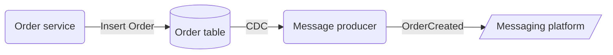
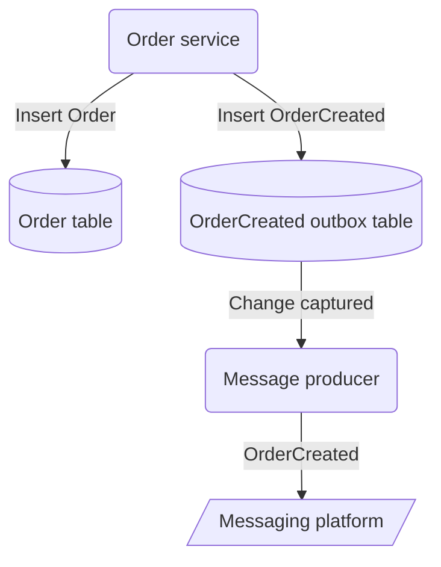

The dual-writes pattern is anytime a workflow has to write to two or more storages while not leveraging any transaction isolation.

This is typically used on systems that can't compromise availability with locking strategies such as [Two Phase Commit][two-phase-commit].

As explained in the [Partial execution: At-most-once vs. At-least-once Deliveries][partial-execution-article] post, this presents consistency challenges in partial execution scenarios, particularly when involving non-queriable storage such as a message bus.
Managing inconsistencies gets even more challenging as a workflow is extended to write to more storages: databases, messaging platforms, cache, elasticsearch, etc...

A workflow may require stronger consistency that guarantees atomicity, which means a guarantee that either the two writes succeed or none of them do, so there is never a partial state.

Another concern with dual-writes is that it reduces the overall availability of a workflow as it is tied to the availability of multiple infrastructure components:

From [AWS SLAs][aws-slas]:
- AWS messaging availability is 99.5% (1-day downtime a year)
- AWS databases availability is 99.5% (1-day downtime a year)

Following the formula for the compound probability of independent events occurring together:
$ P (A \text{ and } B) = P(A) * P(B) $

$ 0.995 * 0.995 = 0.990 $

The overall workflow availability based on dual-writes is reduced to 99.0%, and downtime is amplified to 3-days a year.

# Change Data Capture (CDC)

CDC is a built-in feature in databases such as [Cassandra][cassandra-cdc] and [Cosmos DB][cosmos-cdc] to allow subscription on data changes, i.e. the Observer pattern, with an at-least-once delivery guarantee.

It allows the implementation of a service that reacts to data changes and do some operation, similar to what traditional Triggers provided but completely extracting logic from the database layer.

Databases provide CDC in one of these two flavors:
* Pull-based: Essentially a long and continuous query. Changes are handled in batches to counter polling latency and are ordered by the date and time they happened. It can capture inserts and updates but is limited when capturing deletes.
* Push-based: A low-latency subscription on changes. It reads from the log of transactions and guarantees all data changes are captured.

> How could CDC help to avoid rollbacks on the [at-least-once scenario][article-part-1-rollback]?

One could make a dedicated service that listens to and reacts when a new Order is inserted on the Order table and uses the new record to produce the *OrderCreated* message asynchronously.
This design provides an atomicity guarantee that the message is always produced (eventually) and always after the database writing.

{:style="text-align:center;"}

This is an idea I explored in a previous work when refactoring a project, and while it is on the right track I realized this would be a bad idea.

The main problem is that it takes away from the workflow the power of defining the message content, leading to:
* Increased complexity because the message definition logic is now hidden on this intermediate service that produces the *OrderCreated* message
* The job of the *OrderCreated* message producer is not easy, it is based on lots of inferences, mainly because it doesn't have enough context to do its job except for what it reads from the database Order data model
* The Order data model may become a mix of data and messaging models to facilitate the job of the *OrderCreator* producer. It tries to satisfy both needs but ultimately not fitting any
* Strong coupling between the message model and the Order data model

# The Outbox Pattern

A simpler approach based on CDC is by implementing an Outbox, to define clear boundaries between the data model and the message model.

In the Outbox Pattern the database is used as a queue and leverages a [Transaction Log Tailing][transaction-log-tailling] mechanism based on CDC to replicate data from the database queue to a messaging platform.

The message model is defined on the *OrderCreatedOutbox* table on the database completely decoupled from the Order table model.

A workflow can either do both data and message writing atomically in a database transaction, or if not using transactions at least be able to query the database to check if the message was populated and retry when needed.

Also, the workflows have full control over defining and populating the message.

{:style="text-align:center;"}

The outbox pattern guarantees the message is eventually produced to the messaging platform, and it increases the workflow availability by depending only on the database availability.

# Event Sourcing

> "Eventsourcing uses storage as a way of communication, it solves storage and messaging for you"  Vaugh Vernon, on [Domain-Driven Design Distilled][domain-driven-distilled-book] book

On an event-sourced database, data is stored as if it were messages, there are no tables, instead, there are streams of events that mimic a queue of messages.

When working with event sourcing, a classic confusion is on the difference between events and messages, they have very different purposes and can be simply explained by [Pat Helland's paper][pat-helland-paper] with the difference between *data that lives inside* and *data that lives outside*.

Events are part of the *data that lives inside* (but also immutable) and part of the authoritative data source, while messages are part of the *data that lives outside* and are designed for communication across [Bounded Contexts][bounded-contexts].

Unfortunately, the *Event* term is overloaded and used in both situations, messages are even called *integration events* in the DDD world,
[Martin Fowler][martin-fowler-twitter] has a nice presentation on the many meanings of the *Event* term:

{: .align-center}

An event is a kind of data that carries context to communicate what has happened to an aggregate.
And because it is so closer to a message, it is simpler to outsource the message definition logic to a CDC-based message producer as intended in [Change Data Capture (CDC)](#change-data-capture-cdc).
With an event providing context to the message producer, what is outsourced to this service is mostly the decision of what events should be published to the outside world and the mechanics of using the messaging platform.

However, the same data model concerns pointed out in [Change Data Capture (CDC)](#change-data-capture-cdc) also apply here, and it shouldn't fall into the trap of leaking the message model to the event model,
the publishing service should perform stream-table join operations when needed to enrich the message, gathering related data that is not directly present in the event.

The act of publishing a stream of internal events to the *data that live outside* is also called *Projection*, and in recent work, I used the [Propulsion][propulsion] library on .NET to implement a Projection.
Propulsion provides sources that work from events/messages, i.e. ordered streams, providing the ability to replicate them into another store, with optional custom enrichment steps, and with an exactly-once delivery guarantee. It supports stores such as CosmosDB, DynamoDB, EventStoreDB and Kafka.

[two-phase-commit]: https://martinfowler.com/articles/patterns-of-distributed-systems/two-phase-commit.html
[partial-execution-article]: ../../../2022/06/16/partial-execution-at-most-once-vs-at-least_once-deliveries.html
[aws-slas]: https://aws.amazon.com/legal/service-level-agreements/
[cassandra-cdc]: https://cassandra.apache.org/doc/latest/cassandra/operating/cdc.html
[cosmos-cdc]: https://docs.microsoft.com/en-us/azure/cosmos-db/sql/change-feed-processor
[article-part-1-rollback]: ../../../2022/06/16/partial-execution-at-most-once-vs-at-least_once-deliveries.html#at-least-once-delivery
[transaction-log-tailling]: https://microservices.io/patterns/data/transaction-log-tailing.html
[domain-driven-distilled-book]: https://www.goodreads.com/en/book/show/28602719-domain-driven-design-distilled
[pat-helland-paper]: https://queue.acm.org/detail.cfm?id=3415014
[bounded-contexts]: https://martinfowler.com/bliki/BoundedContext.html
[martin-fowler-twitter]: https://twitter.com/martinfowler
[propulsion]: https://github.com/jet/propulsion